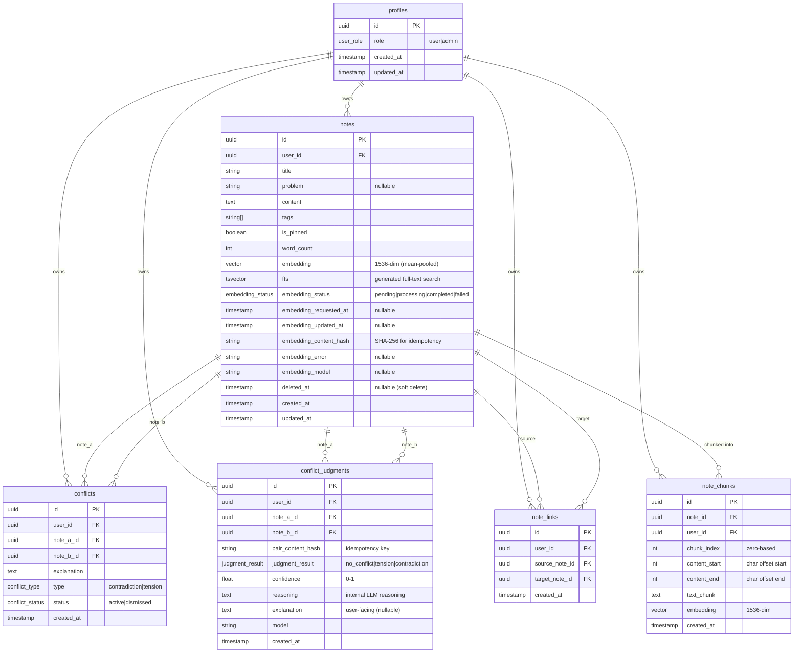
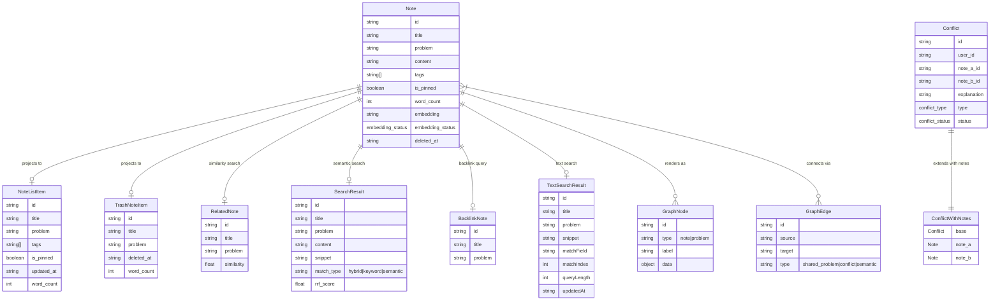
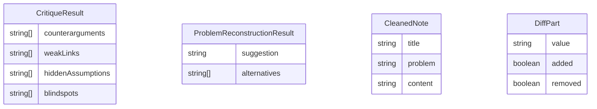
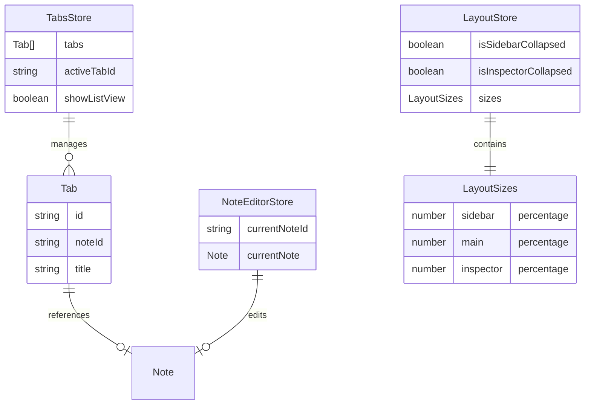
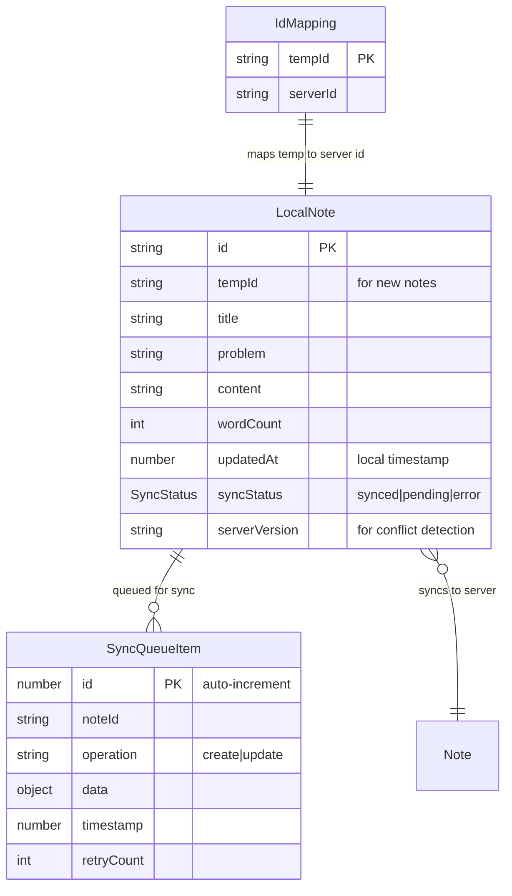
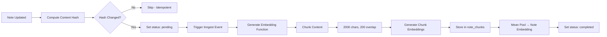

# Data Model Entity Relationship Diagrams

This document provides visual representations of the data models used across the Refinery application at three layers: Database, Service/Feature, and UI State.

---

## 1. Database Schema (Supabase/PostgreSQL)

The core persistence layer using Supabase with PostgreSQL and pgvector for embeddings.

### Enums

| Enum | Values | Description |
|------|--------|-------------|
| `user_role` | `user`, `admin` | Access control role |
| `conflict_type` | `contradiction`, `tension` | Direct vs indirect conflict |
| `conflict_status` | `active`, `dismissed` | Resolution status |
| `judgment_result` | `no_conflict`, `tension`, `contradiction` | LLM conflict judgment verdict |
| `embedding_status` | `pending`, `processing`, `completed`, `failed` | Embedding generation state |

### Key Constraints

| Table | Constraint | Description |
|-------|------------|-------------|
| `conflicts` | `note_a_id < note_b_id` | Prevents duplicate pairs (A,B) and (B,A) |
| `conflict_judgments` | `note_a_id < note_b_id` | Canonical ordering for pairs |
| `conflict_judgments` | `unique(note_a_id, note_b_id, pair_content_hash)` | Idempotency - one judgment per content state |
| `note_links` | `source_note_id != target_note_id` | No self-links |
| `note_chunks` | `unique(note_id, chunk_index)` | Ordered chunks per note |
| `note_chunks` | `content_start >= 0 and content_end > content_start` | Valid character offsets |

### Key Database Functions (RPCs)

| Function | Purpose |
|----------|---------|
| `hybrid_search` | Combined full-text + chunk-based semantic search via RRF |
| `get_related_notes` | Find similar notes using chunk-to-chunk similarity |
| `get_backlinks` | Notes linking to target |
| `find_potential_conflicts` | Detect conflicts using chunk-level embeddings (0.8 threshold) |
| `get_unresolved_conflict_count` | Count for sidebar badge |
| `get_all_tags` | Aggregate tag counts |
| `get_notes_by_tags` | Filter notes by tags |

### Trigger Functions

| Function | Trigger | Purpose |
|----------|---------|---------|
| `update_updated_at` | Before UPDATE | Auto-update `updated_at` timestamp |
| `handle_new_user` | After INSERT on auth.users | Auto-create profile |
| `on_note_soft_delete` | After UPDATE on notes | Delete active conflicts when note trashed |
| `on_note_restore` | After UPDATE on notes | Clean up stale dismissed conflicts |

---

## 2. Service/Feature Models

Application-level types derived from database schema, used in server actions and React Query hooks.

### AI Feature Types

---

## 3. UI State Models (Zustand Stores)

Client-side state management for UI interactions, persisted to localStorage/cookies.

### Store Locations

| Store | File | Persistence |
|-------|------|-------------|
| `TabsStore` | `stores/tabs-store.ts` | localStorage |
| `NoteEditorStore` | `stores/note-editor-store.ts` | Memory only |
| `LayoutStore` | `stores/layout-store.ts` | Cookies |

---

## 4. Local-First Sync (IndexedDB)

Offline-first architecture for notes with background sync to Supabase.

### Sync Flow

1. **Save locally** → IndexedDB with `syncStatus: 'pending'`
2. **Queue sync** → Add to `SyncQueueItem` table
3. **Background sync** → Process queue, call Supabase
4. **Update status** → Mark `syncStatus: 'synced'` on success

### File Locations

| Module | File |
|--------|------|
| DB Setup | `lib/local-db/index.ts` |
| Note Cache | `lib/local-db/note-cache.ts` |
| Sync Queue | `lib/local-db/sync-queue.ts` |

---

## 5. Embedding Pipeline

Chunked embedding system for full semantic coverage of long notes.

### Embedding Configuration

| Setting | Value |
|---------|-------|
| Model | `text-embedding-3-small` |
| Dimensions | 1536 |
| Chunk Size | 2000 characters |
| Chunk Overlap | 200 characters |
| Conflict Threshold | 0.8 similarity |
| Related Notes Threshold | 0.3 similarity |

### File Locations

| Module | File |
|--------|------|
| Trigger Action | `features/notes/actions/trigger-embedding.ts` |
| Generate Function | `lib/inngest/functions/generate-embedding.ts` |
| Reconcile Cron | `lib/inngest/functions/reconcile-embeddings.ts` |
| Content Hash | `lib/embedding/content-hash.ts` |
| Chunker | `lib/embedding/chunker.ts` |
| Mean Pooling | `lib/embedding/mean-pooling.ts` |

---

## Type Definition Locations

| Layer | Location |
|-------|----------|
| Database Types | `types/database.types.ts` (generated) |
| Notes Feature | `features/notes/types.ts` |
| Conflicts Feature | `features/conflicts/types.ts` |
| Graph Feature | `features/graph/types.ts` |
| Search Feature | `features/search/types.ts` |
| AI Feature | `features/ai/types.ts` |
| Trash Feature | `features/trash/types.ts` |
| Layout Types | `types/layout.types.ts` |
